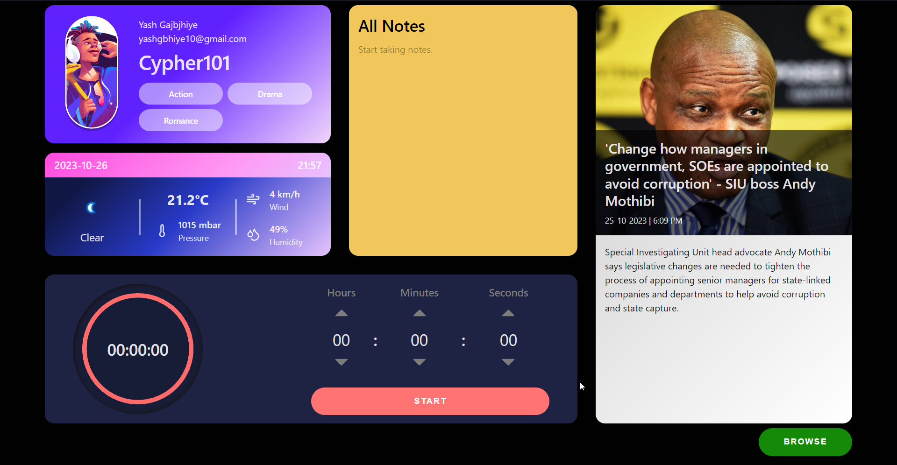

# Super App

React capstone project from cuvette react module, intialized with vite.


## Demo

https://super-app-2a3e0.web.app/


## Screenshots





## Built with

* React
* React router dom v6
* Vite
* Valnilla css
## Run Locally

Clone the project

```bash
  git clone https://github.com/karthikhrd/super-app-1
```

Go to the project directory

```bash
  cd super-app
```

Install dependencies

```bash
  npm i
```

Start the server

```bash
  npm run dev
```

